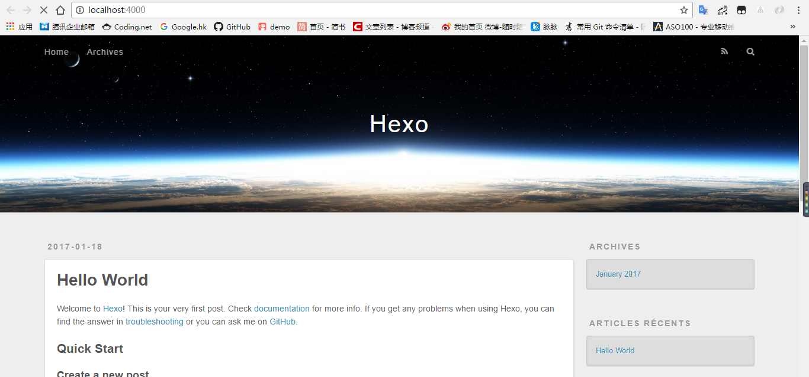
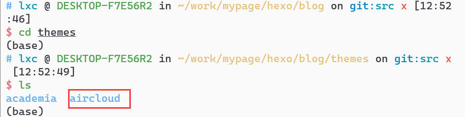
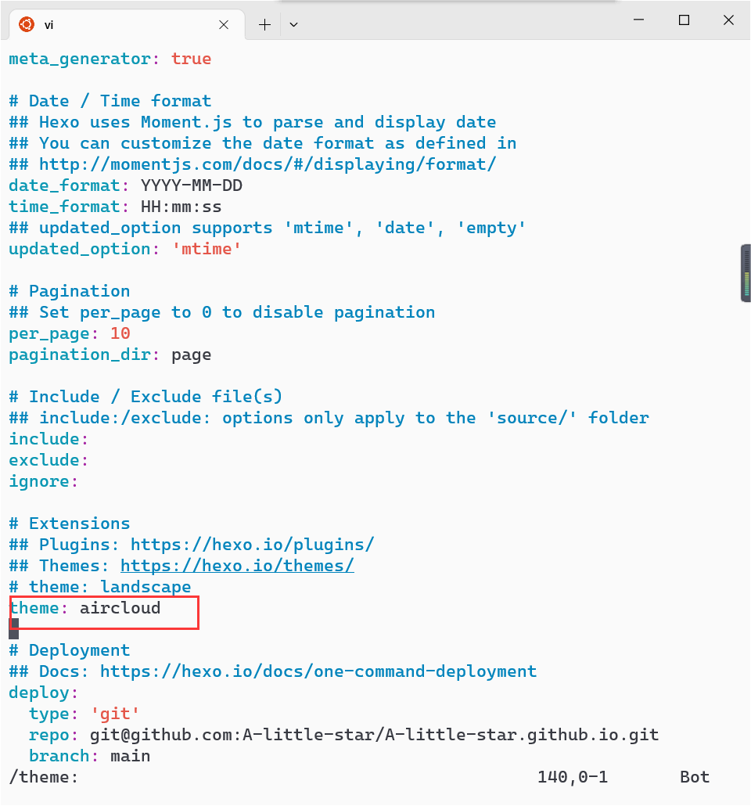

一般情况下，为自己搭建一个个人主页，需要服务器部署、域名解析、网页开发等工作，这些工作非常的繁琐且复杂，非常不适合小白或者没有太多时间的学生党。

但是利用Hexo+GitHub，就可以轻松解决以上的问题。

Hexo是一个基于Node.js的静态博客生成框架，它允许用户以简介的方式创建、管理和发布博客内容，Hexo的设计初衷是为了让用户能够更轻松地搭建个人博客，无需复杂的数据库或服务器设置，只需生成一组静态HTML文件，然后将其部署到一个静态文件托管服务上，如GitHub pages、Netlify等。

而GitHub Pages能够为我们提供一个免费的静态文件托管平台，创建的github.io非常适合用于个人博客、项目文档、作品展示等内容。


## 操作方法

### 一、配置环境

本文使用的操作系统为Win10下的Ubuntu22.04 WSL发行版，实际上是一个Linux系统，至于windows系统，操作方法类似。

#### 1. 安装Node.js。

这里建议大家不要使用Ubuntu自带的apt下载nodejs，因为版本不一定是最新的，建议直接去Nodejs官网去下载比较新的版本。一般情况下nodejs会附带配套的npm（Node Package Manager，是一个用于Node.js环境的包管理工具），如果没有的话可以单独安装一下npm。

这里给大家推荐一个Ubuntu下的nodejs安装教程 https://blog.csdn.net/w20101310/article/details/73135388

windows系统下的小伙伴可以自行STFW（Search the f**king Web）。

**本文使用的Node.js版本为v18.13.0，npm版本为8.19.3**

#### 2. 安装Git。

相信程序员伙伴们都认识这个工具，它实际上是一个非常强大的版本控制软件。

对于还没有使用过git的小伙伴，在Ubuntu下直接apt安装即可（运行以下命令）：

```bash
sudo apt install git
```

windows系统可以自行STFW，git的安装相对简单。

#### 3. 安装hexo。

在命令行中执行：

```bash
npm install hexo-cli -g
```

等待自动安装完成后，输入：

```bash
hexo -v
```

检查是否安装成功，若安装成功，应该显示hexo的版本号。

**本文使用的hexo版本为hexo-cli: 4.3.1**

#### 4. 在github上创建github.io远程仓库。

在github中新建一个仓库，Repository name设置为<username>.github.io，比如我的github用户名是A-little-star，那么创建的仓库名称应为A-little-star.github.io，注意这里必须使用自己的用户名，否则会出错。

### 二、创建Hexo项目，能够在本地运行

#### 1. 初始化Hexo

创建一个文件夹用于存放Hexo项目。比如创建一个名为mypage的目录。

进入mypage目录，运行：

```bash
hexo init blog
```

以上命令会在mypage目录下创建一个新的目录blog，并在blog目录下对hexo项目进行初始化。

接着进入blog目录，运行：

```bash
cd blog
npm install
```

然后利用hexo工具生成网页：

```bash
hexo g
```

完成之后就已经成功在本地创建了一个网页，想查看的话，输入：

```bash
hexo server  # 可以简写为hexo s
```

这条命令会在本地开启一个服务器，提示你可以通过给定的URL访问网页，如下图所示：


默认的网址为http://localhost:4000/。

看到这样的画面，证明配置成功：

  

#### 2. 安装主题

Hexo的主题管理非常的方便易用，更换主题可以采用如下方式：

在浏览器中搜索hexo theme，进入官网的主题页面，里面有300+种主题，你可以选择一种自己喜欢的主题。

这里我使用的主题是Aircloud。

然后进入到该主题的github仓库，将代码clone到hexo项目的themes目录下：

```bash
git clone https://github.com/aircloud/hexo-theme-aircloud.git themes/aircloud
```

完成之后，进入到themes文件夹，可以看到里面多了一个aircloud。



然后进入到项目根目录，修改其中的_config.yml文件，将以theme: 开头的行改为theme: aircloud



然后再运行hexo s进行本地测试。

会发现主题发生了变化。

#### 3.修改博客内容

博客上显示的基本信息基本上都在_config.yml文件中设置，只需要在 _config.yml 文件中修改对应的信息，既可以在网站上呈现出不同的信息，对于具体的主题，每个主题的github仓库的README.md文件中都会给出比较详细的配置方式。

最后，**很关键的一步！！！**

在_config.yml中的Deployment部分中，将远程仓库地址添加上去：


### 三、将本地项目部署到远程仓库

#### 1. 安装部署工具

继续在本地的项目根目录安装部署工具：

```bash
npm install hexo-deployer-git --save
```

**注意：**只有以上命令执行成功才能将主页部署到github.io上去！

#### 2. 初始化本地仓库：

```bash
git init
```

#### 3. 连接远程仓库

```bash
git remote add origin git@github.com:A-little-star/A-little-star.github.io.git
```

#### 4. 发布hexo到github page

```
hexo clean && hexo g && hexo d
```

hexo clean将删除旧的静态文件及其他缓存文件；

hexo g 命令实际上是hexo generate的简写，根据源文件生成静态HTML文件；

hexo d 命令实际上是hexo deploy的简写，它将把生成的静态文件部署到github上去。

执行完以上命令后，打开github，你会发现你的github.io仓库中多了一些文件，这就是hexo d命令部署上去的。

#### 5. 将本地源代码推送至远程

由于github.io仓库中已经存放了部署的静态网页，所以我们新建一个分支src，将源码放在这个分支下面，用于后续开发：

```bash
git add .
git commit -m 'First commit.'
git checkout -b src
git push -u origin src
```

接下来打开网站就可以看到效果了。

#### 6. 之后修改

之后每次修改后，都可以用hexo clean && hexo g来生成网页，在本地通过hexo s调试之后，hexo d部署到远程，然后将源码push到远程仓库即可。